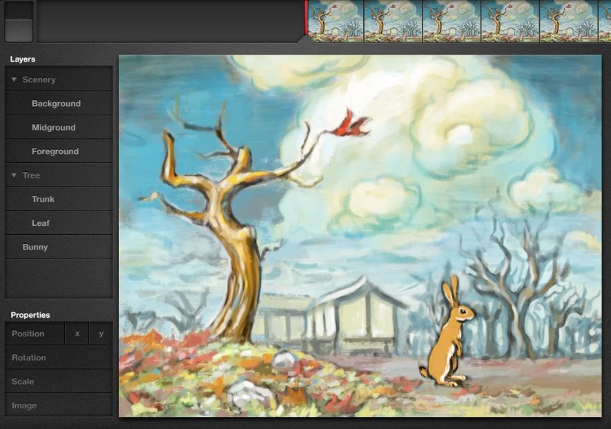

# Bret Victor’s animation performance app

Created at: April 14, 2026 4:29 PM
Link: https://vimeo.com/906418692

In 2012, Bret Victor gave a brilliant talk “Inventing on Principle”, where he presented the idea of creative people having tools that give them direct control over what they are creating and getting immediate feedback. He argues that tools should better integrate the input with the feedback, so people can experiment at the speed of thought and use the tools in a more intuitive way.

At one point, he shows how cumbersome it is to create an animation of a falling leaf using Flash, where the user has to determine various keyframes for the movement and practically guess the time between each keyframe, until finally applying a tween and seeing a very rigid movement of the leaf. He then shares a demo of an animation app he built, that allows him to “perform” the animation in a controlled manner but in real time, rather than build it using keyframes, tweens and acceleration curves. Bret never released this app, so I want to build it, using his demo as a reference.

## Overview of the animation UI

Bret’s app seems to be a native iPad app, which he operates using both his hands. The multi-touch interactivity is important because everything is done directly with his hands touching the screen of the iPad. No extra input devices such as a mouse or a keyboard.

Main animation UI

The main animation UI shows the animation timeline at the top, represented by a series of thumbnails that previews the animation over time and indicates where the playhead is currently at. There is a toggle switch on the left of the timeline, which he toggles to play / pause the timeline playback. On the left is a “Layers” panel, which is a tree view of the different image assets as layers that can be grouped. Also on the left is a “Properties” panel, with the buttons: “Position x”, “Position y”, “Rotation”, “Scale” and “Image”. The main area is the canvas, showing the current frame of the animation.

In his demo, the scene has a scenery group with background, midground and foreground layers; a tree group with a tree and a leaf; and a bunny asset which has 3 different images (different poses of the rabbit). He starts by animating the leaf falling, then the assets moving left to simulate a camera pan and the bunny hopping to the right.

## Selecting and manipulating layers

While he is holding an asset’s layer in the layers panel with his left thumb, he can drag that corresponding layer with his right finger on the canvas. If he does this while the timeline is playing, whatever he does on the canvas gets recorded in the animation. The most basic manipulation is this layer selection and dragging it around on the canvas.

The way I think this app works is that at each frame, each asset has its own x an y position values, rotation value, scale value and image value (assets can be made up of multiple images, but only one can be shown on the canvas at any given time for that instance of the asset). These values get overwritten while the asset’s properties are being manipulated on the canvas. So the user has the freedom to play the timeline and “perform” these changes in real time and the changes are recorded, or he can drag the timeline and change the values frame by frame if he wants to. Each property can be changed independently.

## Manipulating layer properties

To manipulate an asset’s property, he first needs a property UI controller. For this, he drags a property button from the properties panel out to the canvas. When dragging each property button into the canvas, the property he’s dragging becomes a floating UI controller widget, appropriate for that particular property:

- X Position: Horizontal slider
- Y Position: Vertical slider
- Rotation: Circular slider
- Scale: Horizontal slider
- Image: Thumbnail set of the different images from the asset

His app didn’t have it, but it would be useful to have a “Transparency” property also. The UI controller for it could be a horizontal slider.

Floating circular slider widget to manipulate the asset’s rotation

While holding an asset’s layer and manipulating the property controller widget, that property for that asset will be written to the current frame. If the timeline is playing, this will happen continuously for each frame. This way, he can for example play the animation, perform a property change in real time time for a particular asset, then scrub back the timeline and perform another property change for that same asset (or for any other asset). Whatever property, property value and layer that are currently selected and being manipulated overwrite whatever value was there previously at that frame. As soon as his finger lifts from the property control widget, it stops overwriting the property value, even though the timeline keeps playing if the playback is activated.

He does this to animate the leaf falling. First he activates the timeline playback and performs the leaf movement by dragging it in a falling motion on the canvas. Then he rewinds the timeline, pulls out a rotation control widget and while the timeline is playing and the leaf is falling, he holds the leaf layer in the layers panel and drags the rotation control widget slider, to perform the rotation as the leaf is falling.

Whenever he’s done interacting with a particular floating widget and wants to dismiss it, he simply flicks it off screen.

## Manipulating multiple layers

Another interaction he does is to select multiple layers. He does this by dragging one asset’s layers onto the canvas with his right finger. When he drags the layer onto the canvas, it becomes a floating “Layer list” widget, which is a list of the selected layers, starting with the actual layer he dragged out. While still holding the list widget with his right finger, he adds other layers to this list by tapping or dragging down on the layers panel with his left thumb and they fly into the floating layers list widget.

Adding layers to the “Layer list” floating widget

Each layer in the layers list widget has a percentage next to it, which indicates the sensitivity; or how much of the property that is being manipulated will affect that particular layer. For example, to simulate a camera pan and create a parallax effect, he selects all the layers and drags the percentages sideways to set a lower percentage value on the midground and background layers. This way, when he drags out an X position widget, holds the layer list widget (to set that those layers’ property will be affected by the widget manipulation), activates playback and drags the X position slider, all the selected layers are affected by the position slider, and the layers with a lower percentage value are affected at that percentage fraction which makes them move slower.

Changing the x position of the selected layers all at once and previewing the lower sensitivity of the background layers to see how the parallax effect will look like

To animate the bunny hopping to the right, he rewinds the timeline to the beginning and activates playback. Whenever he wants the bunny to start jumping, he drags him on the canvas, on a jumping motion. Then he rewinds again and drags out an “Image” property while holding down the bunny layer in the layers panel. The image property floating widget shows the thumbnails of the different poses of the bunny, contained in the asset, with the current pose selected.

Image property floating widget, with the different bunny poses

---

Bret’s demo focuses mostly on the animation interactions, showcasing it as a way to create an animation in just a few minutes, but I think this app could well have an asset creation side to it. Where you create your assets, convert them to instances and then switch to the animation UI to compose the scene and animate the instances. It would be similar to what Flash used to be, but with this direct manipulation and performance capture way of animating using multi-touch.

For an MVP though, I would build only this animation UI and allow the user to import images and sets of images (like the bunny with multiple poses would be a set of images) to be the asset layers. This way we can test, validate and fine tune all the animation interactions as Bret demonstrated, before actually building out the rest of what could be a successor to Flash.

I really want this to be a webapp, like Figma is, that runs smoothly in the browser but feels like a native app. I don’t think it needs any low-level system APIs other than what the browser can deliver. I even found this demo that shows it’s possible for the browser to get force, angle and rotation data from a stylus such as the Apple Pencil: [https://github.com/shuding/apple-pencil-safari-api-test](https://github.com/shuding/apple-pencil-safari-api-test)
